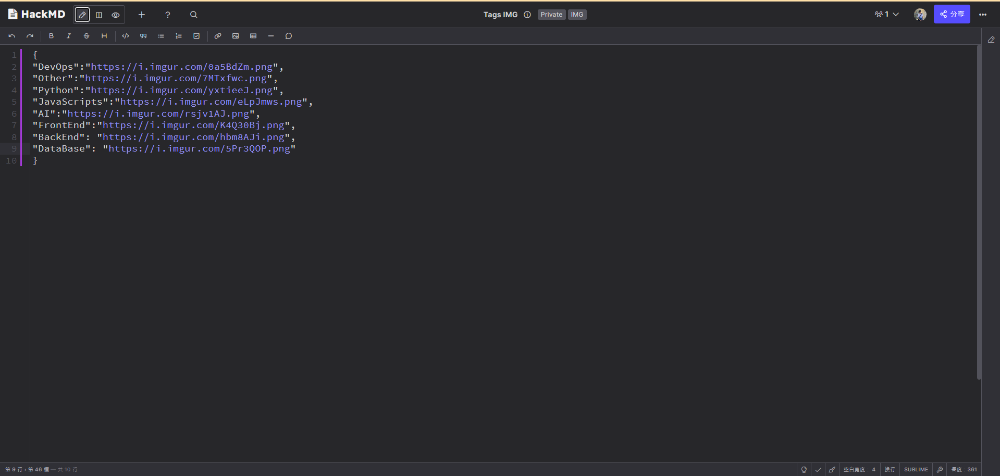

# getNoteAPI
> Connected with hackMD API, easy to deploy and quick to use.

## Update record
* 04/18/2024: Version one online
* 04/19/2024: Add cache
* 04/20/2024: 
  * Add Private tags, if notes have "Private" tag, it can't be get by client.
  * Add IMG tags, `get_tags_list` router will return each tags name 、 counts and img.
* 05/26/2024: Add router path for healthy check.
* 06/29/2024: improve code error handling.

## Setup
* [Get Your HackMD token](https://hackmd.io/@hackmd-api/developer-portal/https%3A%2F%2Fhackmd.io%2F%40hackmd-api%2FrkoVeBXkq)
* Please obtain your HackMD token first, and then create a .env file. Write your token in the file as shown in the example below:
```python
# .env
hackmd_token=<your_hackmd_token>
```

### HackMD Setting
* Custom "tag" for your every note.
* Add "Private" tag to the notes if you want to hide it from client.
* Add "IMG" tag to the notes and follow the format below:
   * Content use JSON format, keys are the tags name and values are the image url.
   * It will be return in the `get_tags_list` router.



### 1. Run local
```bash
pip install -r requirements.txt
cd src/
python api.py
```
### 2. Docker
```bash
docker build -t get_note_api .
docker run -p 8000:8000 -e hackmd_token=<your_hackmd_token> get_note_api
```

### Request
#### CURL
```bash
# healthy check
curl -X 'GET' \
  'http://localhost:8000/api/v1/ping' \
  -H 'accept: application/json'

# get_tags_list
curl -X 'GET' \
  'http://localhost:8000/api/v1/get_tags_list' \
  -H 'accept: application/json'

# get_notes_by_tag
curl -X 'POST' \
  'http://localhost:8000/api/v1/get_notes_by_tag' \
  -H 'accept: application/json' \
  -H 'Content-Type: application/json' \
  -d '{
  "tag": <note_tag>
}'

# get_note_by_id
curl -X 'POST' \
  'http://localhost:8000/api/v1/get_note_by_id' \
  -H 'accept: application/json' \
  -H 'Content-Type: application/json' \
  -d '{
  "nid": <note_id>
}'
```

### Response
```python
# ping
{
  "result": "alive"
}

# get_tags_list
[
  {
    "category": "string",
    "counts": int,
    "img": "string"
  }
]

# get_notes_by_tag
[
  {
    "id": "string",
    "title": "string",
    "tags": "string",
    "lastUpdate": "string"
  }
]

# get_note_by_id
{
  "id": "string",
  "title": "string",
  "tags": "string",
  "content": "string",
  "lastUpdate": "string"
}
```
### Errors Response

#### NO_TOKEN_ERROR
```python
JSONResponse({'result': 'NO_TOKEN_ERROR'}, 401)
```
#### NOTES_NOT_EXIST_ERROR
```python
JSONResponse({'result': 'NOTES_NOT_EXIST_ERROR'}, 400)
```
#### NO_RESULT_ERROR
```python
JSONResponse({'result': 'NO_RESULT_ERROR'}, 400)
```
#### INTERNAL_ERROR
```python
JSONResponse({'result': 'INTERNAL_ERROR'}, 500)
```
